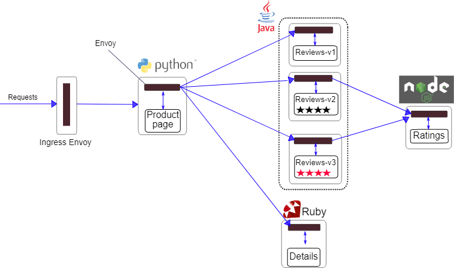

# 网关
网关就是流量的出入口，像spring cloud gateway，在Istio Bookinfo Application示例应用中，如下图：

Istio内置了istio-ingressgateway和istio-engressgateway（这两个名字很。。。）。

# 网关示例
```yaml
apiVersion: networking.istio.io/v1alpha3
kind: Gateway
metadata:
  name: ext-host-gateway
spec:
  selector:
    app: my-gateway-controller
  servers:
  - port: 443
      number: 443
      name: https
      protocol: HTTPS
    hosts:
    - ext-host.example.com
    tls:
      mode: SIMPLE
      serverCertificate: /tmp/tls.crt
      privateKey: /tmp/tls.key
```

定义了网关规则后，虚拟服务可以使用gateways来把网关绑定到虚拟服务上。
```yaml
apiVersion: networking.istio.io/v1alpha3
kind: VirtualService
metadata:
  name: virtual-svc
spec:
  hosts:
  - ext-host.example.com
  gateways:
    - ext-host-gateway
```