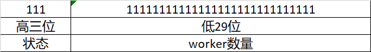

# 状态解释
ThreadPoolExecutor的成员变量ctl是用来控制状态和Worker数量，代码如下：
```java
private final AtomicInteger ctl = new AtomicInteger(ctlOf(RUNNING, 0));
```
AtomicInteger使用Int作为存储，Int有32位，ThreadPoolExecutor对ctl的32位进行划分，其中高三位用于存储线程池状态，低29位用来存储Worker数量。



| #   | 状态名        | 状态说明                                        | 状态值        |
|-----|------------|---------------------------------------------|------------|
| 1   | RUNNING    | 接受新任务并处理队列中的任务                              | -536870912 |
| 2   | SHUTDOWN   | 不接受新任务，但是会处理队列中的任务                          | 0          |
| 3   | STOP       | 不接受新任务，同时也不会处理队列中的任务，并且会中断正在执行的任务           | 536870912  |
| 4   | TIDYING    | 所有的任务都已经终止，Woker线程数量为0并且会调用terminated()钩子函数 | 1073741824 |
| 5   | TERMINATED | terminated()钩子函数执行完成后                       | 1610612736 |

> The runState provides the main lifecycle control, taking on values: 
>
*   RUNNING:  Accept new tasks and process queued tasks
*   SHUTDOWN: Don't accept new tasks, but process queued tasks
*   STOP:     Don't accept new tasks, don't process queued tasks,
*             and interrupt in-progress tasks
*   TIDYING:  All tasks have terminated, workerCount is zero,
*             the thread transitioning to state TIDYING
*             will run the terminated() hook method
*   TERMINATED: terminated() has completed

# 状态转换
状态转换图：


# 任务执行
## execute
```java
// 获取ctl
int c = ctl.get();
// 计算当前线程池中的worker数量是否小于corePoolSize
if (workerCountOf(c) < corePoolSize) {
    // 如果小于corePoolSize则新建线程向线程池中添加该线程
    if (addWorker(command, true))
        // 添加线程成功直接return
        return;
    c = ctl.get();
}

// 如果任务没有直接添加到线程池
// 如果线程池处于RUNNING状态，那么就将任务添加到等待队列中
 if (isRunning(c) && workQueue.offer(command)) {
    int recheck = ctl.get();
    // 将任务添加到队列后再次检查是否线程池是否处于运行状态
    // 如果线程池不在运行状态，那么就将任务从任务队列中移除
    // 并且调用Reject策略
    if (! isRunning(recheck) && remove(command))
        reject(command);
    // 检查worker数量是否为0，如果为0则向线程池添加worker
    else if (workerCountOf(recheck) == 0)
        addWorker(null, false);
}
// 如果线程池不处于运行状态或者任务不能入队就尝试添加线程池
// 如果线程没有新建成功，那么此时线程池可能已经停止或者饱和（已经达到最大线程数且队列已经达到最大数量）
// 那么就调用Reject策略
else if (!addWorker(command, false))
    reject(command);
```
## submit

## invoke

# 线程池停止（shutdown）
```java
public void shutdown() {
    final ReentrantLock mainLock = this.mainLock;
    mainLock.lock();
    try {
        checkShutdownAccess();
        advanceRunState(SHUTDOWN);
        interruptIdleWorkers();
        onShutdown(); // hook for ScheduledThreadPoolExecutor
    } finally {
        mainLock.unlock();
    }
    tryTerminate();
}
```

# 线程池立即停止（shutdownNow()）

# 线程池等待终止（awaitTermination）
线程池等待状态进入TERMINATED状态后返回。