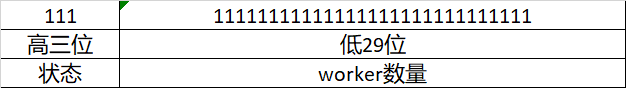
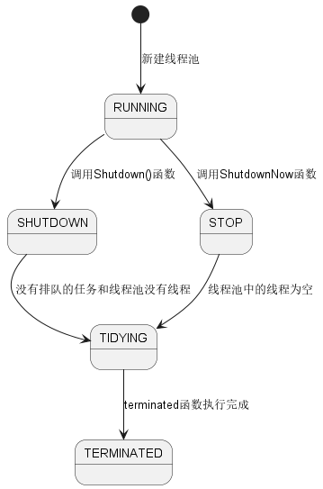

# 状态解释
ThreadPoolExecutor的成员变量ctl是用来控制状态和Worker数量，代码如下：
```java
private final AtomicInteger ctl = new AtomicInteger(ctlOf(RUNNING, 0));
```
AtomicInteger使用Int作为存储，Int有32位，ThreadPoolExecutor对ctl的32位进行划分，其中高三位用于存储线程池状态，低29位用来存储Worker数量。



| #   | 状态名        | 状态说明                                        | 状态值        |
|-----|------------|---------------------------------------------|------------|
| 1   | RUNNING    | 接受新任务并处理队列中的任务                              | -536870912 |
| 2   | SHUTDOWN   | 不接受新任务，但是会处理队列中的任务                          | 0          |
| 3   | STOP       | 不接受新任务，同时也不会处理队列中的任务，并且会中断正在执行的任务           | 536870912  |
| 4   | TIDYING    | 所有的任务都已经终止，Woker线程数量为0并且会调用terminated()钩子函数 | 1073741824 |
| 5   | TERMINATED | terminated()钩子函数执行完成后                       | 1610612736 |
线程池状态值的关系：TERMINATED > TIDYING > STOP > SHUTDOWN > RUNNING。

> The runState provides the main lifecycle control, taking on values: 
>
*   RUNNING:  Accept new tasks and process queued tasks
*   SHUTDOWN: Don't accept new tasks, but process queued tasks
*   STOP:     Don't accept new tasks, don't process queued tasks,
*             and interrupt in-progress tasks
*   TIDYING:  All tasks have terminated, workerCount is zero,
*             the thread transitioning to state TIDYING
*             will run the terminated() hook method
*   TERMINATED: terminated() has completed

# 状态转换
状态转换图：


# 线程池构造
## 构造函数实现
```java
public ThreadPoolExecutor(int corePoolSize,
                              int maximumPoolSize,
                              long keepAliveTime,
                              TimeUnit unit,
                              BlockingQueue<Runnable> workQueue,
                              ThreadFactory threadFactory,
                              RejectedExecutionHandler handler) {
    if (corePoolSize < 0 ||
        maximumPoolSize <= 0 ||
        maximumPoolSize < corePoolSize ||
        keepAliveTime < 0)
        throw new IllegalArgumentException();
    if (workQueue == null || threadFactory == null || handler == null)
        throw new NullPointerException();
    this.corePoolSize = corePoolSize;
    this.maximumPoolSize = maximumPoolSize;
    this.workQueue = workQueue;
    this.keepAliveTime = unit.toNanos(keepAliveTime);
    this.threadFactory = threadFactory;
    this.handler = handler;
}
```

## 构造函数说明
ThreadPoolExecutor构造函数的参数最多有7个参数，参数分别为：

| #   | 参数名                               | 说明                                                                                             |
|-----|-----------------------------------|------------------------------------------------------------------------------------------------|
| 1   | int corePoolSize                  | 核心线程数， 线程池保留的最小线程数量，如果设置了allowCoreThreadTimeout，线程池会在空闲时销毁核心线程                                 |
| 2   | int maximumPoolSize               | 最大线程数， 线程池允许的最大线程数，线程池达到corePoolSize设置的线程数量且workQueue已满，那么线程池会自动增加线程数量直到设置的maximumPoolSize设置的值 |
| 3   | long keepAliveTime                | 当线程池的线程数量大于corePoolSize时， 从任务队列阻塞获取任务的最长时间，超过keepAliveTime设置的时间则认为可以销毁大于corePoolSize的线程        |
| 4   | TimeUnit unit                     | keepAliveTime的时间单位                                                                             |
| 5   | BlockingQueue<Runnable> workQueue | 任务队列                                                                                           |
| 6   | ThreadFactory threadFactory       | 创建新线程的线程工厂                                                                                     |
| 7   | RejectHandler handler             | 任务拒绝策略                                                                                         |


## 拒绝策略
拒绝策略是ThreadPoolExecutor无法执行任务且任务也无法排队时的处理策略，这种情况下ThreadPoolExecutor中的线程数量为maximumPoolSize且workQueue已满。
ThreadPoolExecutor内置四种任务拒绝策略,也可以实现自定义的拒绝策略，实现自定义拒绝策略只需要实现RejectedExecutionHandler接口即可：

| #   | 名称                  | 说明                                     |
|-----|---------------------|----------------------------------------|
| 1   | CallerRunsPolicy    | 调用者执行策略，就是谁向线程池提交任务谁执行该任务              |
| 2   | AbortPolicy         | 直接抛出RejectedExecutionException         |
| 3   | DiscardPolicy       | 不执行任务直接丢弃无通知，可以根据业务的容忍度使用              |
| 4   | DiscardOldestPolicy | 丢弃workQueue队头的第一个任务并将该任务添加到workQueue队尾 |


# 任务执行
## execute函数主逻辑
```java
// 获取ctl
int c = ctl.get();
// 计算当前线程池中的worker数量是否小于corePoolSize
if (workerCountOf(c) < corePoolSize) {
    // 如果小于corePoolSize则新建线程向线程池中添加该线程
    if (addWorker(command, true))
        // 添加线程成功直接return
        return;
    c = ctl.get();
}

// 如果任务没有直接添加到线程池
// 如果线程池处于RUNNING状态，那么就将任务添加到等待队列中
 if (isRunning(c) && workQueue.offer(command)) {
    int recheck = ctl.get();
    // 将任务添加到队列后再次检查是否线程池是否处于运行状态
    // 如果线程池不在运行状态，那么就将任务从任务队列中移除
    // 并且调用Reject策略
    if (! isRunning(recheck) && remove(command))
        reject(command);
    // 检查worker数量是否为0，如果为0则向线程池添加worker
    else if (workerCountOf(recheck) == 0)
        addWorker(null, false);
}
// 如果线程池不处于运行状态或者任务不能入队就尝试添加线程池
// 如果线程没有新建成功，那么此时线程池可能已经停止或者饱和（已经达到最大线程数且队列已经达到最大数量）
// 那么就调用Reject策略
else if (!addWorker(command, false))
    reject(command);
```

## addWorker逻辑
addWorker主流程：检查添加Worker前置添加->启动worker->运行worker
```java
private boolean addWorker(Runnable firstTask, boolean core) {
retry:
for (;;) {
    // 获取状态和worker数量
    int c = ctl.get();
    // 获取线程池状态
    int rs = runStateOf(c);

    // 重写一下源码逻辑，老逻辑稍微有点难理解
    // 这里是判断线程池状态是否为RUNNING状态，如果不是RUNNING状态，那么就不能向线程池添加Worker
    // rs >= SHUTDOWN是指线程池状态为SHUTDOWN、TIDYING、STOP和TERMINATED四种状态
    // 首先rs>=SHUTDOWN指定了线程池当前的状态是TIDYING、STOP和TERMINATED四种状态
    // 然后判断 rs != SHUTDOWN，那么线程池状态为TIDYING、STOP和TERMINATED三种状态
    if (rs >= SHUTDOWN &&
        (rs != SHUTDOWN ||
           firstTask != null ||
           workQueue.isEmpty()))
        return false;

    for (;;) {
        // 获取worker数量，如果worker数量大于最大的worker数量（2^29-1）
        // 或者worker数量大于coreSize或者maximumSize直接返回
        int wc = workerCountOf(c);
        if (wc >= CAPACITY ||
            wc >= (core ? corePoolSize : maximumPoolSize))
            return false;
        
        // worker数量加1，如果成功就退出retry，
        // 如果失败则重新获取线程池状态，如果线程池状态发生改变就跳转到retry重新执行
        // 这里如果增加worker数量失败可能有两个原因：worker数量变更和线程池状态改变
        if (compareAndIncrementWorkerCount(c))
            break retry;
        c = ctl.get();  // Re-read ctl
        
        // 这里来处理线程池状态变更，线程池状态变更就需要从retry开始重新验证线程池状态
        if (runStateOf(c) != rs)
            continue retry;
        else {
        // else CAS failed due to workerCount change; retry inner loop
        // 这里处理worker数量变更，只需要重新验证worker线程数量逻辑，重新循环即可
        }
    }
}

// 走到这里说明线程池状态正常并且线程池worker数量没有大于corePoolSize和maximumPoolSize
// 创建worker并添加到worker列表中
boolean workerStarted = false;
boolean workerAdded = false;
Worker w = null;
try {
    w = new Worker(firstTask);
    final Thread t = w.thread;
    if (t != null) {
        final ReentrantLock mainLock = this.mainLock;
        mainLock.lock();
        try {
            // Recheck while holding lock.
            // Back out on ThreadFactory failure or if
            // shut down before lock acquired.
            int rs = runStateOf(ctl.get());

            if (rs < SHUTDOWN ||
                (rs == SHUTDOWN && firstTask == null)) {
                if (t.isAlive()) // precheck that t is startable
                    throw new IllegalThreadStateException();
                workers.add(w);
                int s = workers.size();
                if (s > largestPoolSize)
                    largestPoolSize = s;
                workerAdded = true;
            }
        } finally {
            mainLock.unlock();
        }
        if (workerAdded) {
            t.start();
            workerStarted = true;
        }
    }
} finally {
    if (! workerStarted)
        addWorkerFailed(w);
}
return workerStarted;
}
```

## runWorker函数
```java
final void runWorker(Worker w) {
    Thread wt = Thread.currentThread();
    Runnable task = w.firstTask;
    w.firstTask = null;
    w.unlock(); // allow interrupts
    boolean completedAbruptly = true;
    try {
        while (task != null || (task = getTask()) != null) {
            w.lock();
            // 如果线程池正在停止，那么中断线程
            // 如果线程池不处于正在停止状态，那么保证线程不被中断
            // If pool is stopping, ensure thread is interrupted;
            // if not, ensure thread is not interrupted.  This
            // requires a recheck in second case to deal with
            // shutdownNow race while clearing interrupt
            if ((runStateAtLeast(ctl.get(), STOP) ||
                 (Thread.interrupted() &&
                  runStateAtLeast(ctl.get(), STOP))) &&
                !wt.isInterrupted())
                wt.interrupt();
            try {
                // 任务执行前需要执行的函数
                beforeExecute(wt, task);
                Throwable thrown = null;
                try {
                    // 任务真正执行
                    task.run();
                } catch (RuntimeException x) {
                    thrown = x; throw x;
                } catch (Error x) {
                    thrown = x; throw x;
                } catch (Throwable x) {
                    thrown = x; throw new Error(x);
                } finally {
                    // 任务执行前需要执行的函数
                    afterExecute(task, thrown);
                }
            } finally {
                task = null;
                w.completedTasks++;
                w.unlock();
            }
        }
        completedAbruptly = false;
    } finally {
        // 任务执行完成后从任务队列中移除任务
        // 
        processWorkerExit(w, completedAbruptly);
    }
}
```
## submit

## invoke

# 线程池停止（shutdown）
```java
public void shutdown() {
    final ReentrantLock mainLock = this.mainLock;
    mainLock.lock();
    try {
        checkShutdownAccess();
        advanceRunState(SHUTDOWN);
        interruptIdleWorkers();
        onShutdown(); // hook for ScheduledThreadPoolExecutor
    } finally {
        mainLock.unlock();
    }
    tryTerminate();
}
```

# 线程池立即停止（shutdownNow）
```java
public List<Runnable> shutdownNow() {
    List<Runnable> tasks;
    final ReentrantLock mainLock = this.mainLock;
    mainLock.lock();
    try {
        checkShutdownAccess();
        advanceRunState(STOP);
        interruptWorkers();
        tasks = drainQueue();
    } finally {
        mainLock.unlock();
    }
    tryTerminate();
    return tasks;
}
```
# 线程池等待终止（awaitTermination）
线程池等待状态进入TERMINATED状态后返回。
```java
 public boolean awaitTermination(long timeout, TimeUnit unit)
    throws InterruptedException {
    long nanos = unit.toNanos(timeout);
    final ReentrantLock mainLock = this.mainLock;
    mainLock.lock();
    try {
        for (;;) {
            if (runStateAtLeast(ctl.get(), TERMINATED))
                return true;
            if (nanos <= 0)
                return false;
            nanos = termination.awaitNanos(nanos);
        }
    } finally {
        mainLock.unlock();
    }
}
```