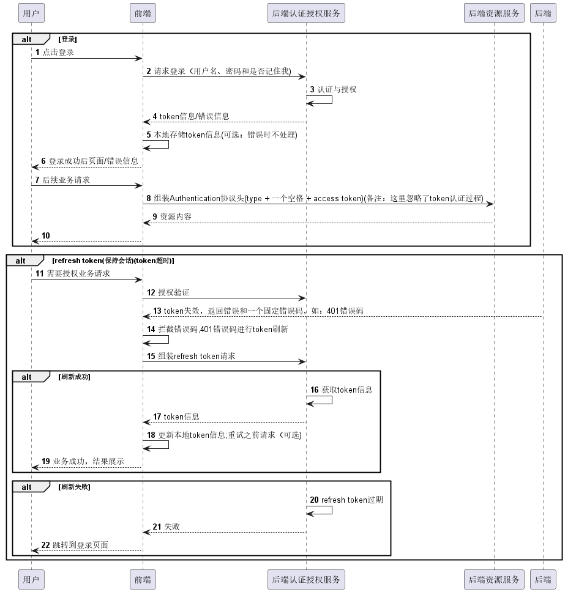

# TODO List APP
前端均采用PC Web，前端打包为静态页面；后端根据情况选择Jar包或docker部署。

## 1. 功能
### 1.1 登录
#### 1.1.1 说明
| 字段   | 规格                              | 说明                    | 
|------|---------------------------------|-----------------------|
| 用户名  | 最短3个字，最长64个字                    | 邮箱最长可以有几百个字，我们定义为64个字 | 
| 用户密码 | 最短为8个字，最长为20个字，组合要求：必须有大小写字母、数字 |                       |

#### 1.1.2 功能列表
1. 登录 （remember me功能第一个迭代不开发）
2. 登出
3. 注册 （注册不需要手机号）
4. 刷新token(保持会话)

### 1.2 任务列表
#### 1.2.1 说明
| 字段          | 规格              | 说明  | 
|-------------|-----------------|-----|
| 任务Title     | 最短为1个字，最长50个字   |     | 
| 任务Sub Title | 最短为1个字，最长为200个字 |     |
#### 1.2.2 功能列表
1. 创建任务
2. 任务列表(不分页)
3. 删除任务
4. 更改任务状态（暂时不支持状态转为之前的状态，目前只支持start---创建任务--->TODO----完成---->Done这类转换）


## 2. 前后端交互流程
登录采用OAuth2方式，后端接口在登录成功后会返回token、refresh token、token类型和token过期时间字段，前端需要存储这些字段，并将Token类型+空格+token放到Authentication协议头中请求需要授权访问的资源。
token有过期时间，默认设置为两小时，如果token过期后后端会返回固定错误码，前端需要拦截错误码使用refresh token进行会话保持，如果会话保持失败，前端跳转到登录页面，如果会话保持成功，后端会返回和登录一样的字段，前端需要将本地存储中的登录信息进行替换。

### 2.1 登录 & 刷新token


## 3. 接口定义
### 3.1 响应内容数据结构
| name       | type    | desc                                                 |
|------------|---------|------------------------------------------------------|
| success    | boolean | 接口请求是否成功，true: 成功，false: 失败，详细可以参考errCode和errMessage | 
| errCode    | string  | 错误码，如果success的值为false，此处为错误的错误码，否则为null              | 
| errMessage | string  | 错误消息，如果success的值为false，此处为错误的消息，否则为null              | 
| data       | object  | 接口如果需要返回数据，则data字段存在。数据类型参考各个接口结构定义                  | 

#### 响应内容示例：
1. 无数据成功返回
```json
{
  "success": true,
  "errCode": null,
  "errMessage": null
}
```

2. 无数据失败返回
```json
{
  "success": false,
  "errCode": "401",
  "errMessage": "Authentication failed"
}
```

3. 有数据成功返回
```json
{
  "success": true,
  "errCode": null,
  "errMessage": null,
  "data": "Hello world!"
}
```

### 3.2 接口列表（不完整）
#### 3.2.1 登录
#### 3.2.2 注册
#### 3.2.3 登出
#### 3.2.4 refresh token
#### 3.3.1 创建任务
#### 3.3.2 任务列表
#### 3.3.3 删除任务
#### 3.3.4 更改任务状态
